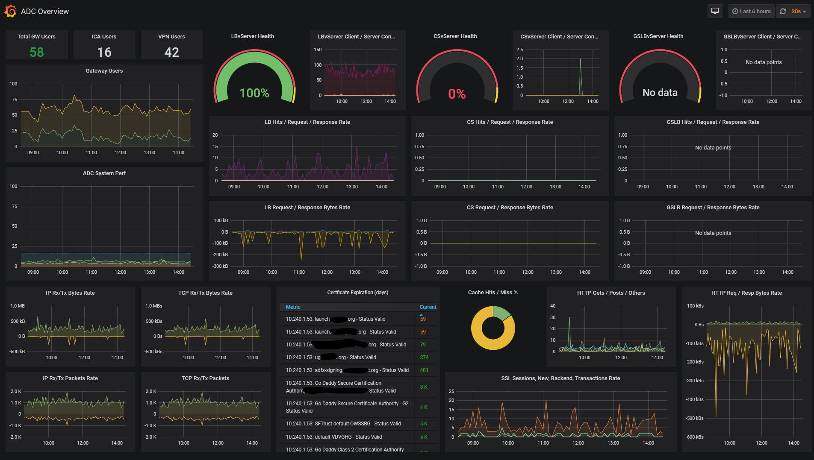
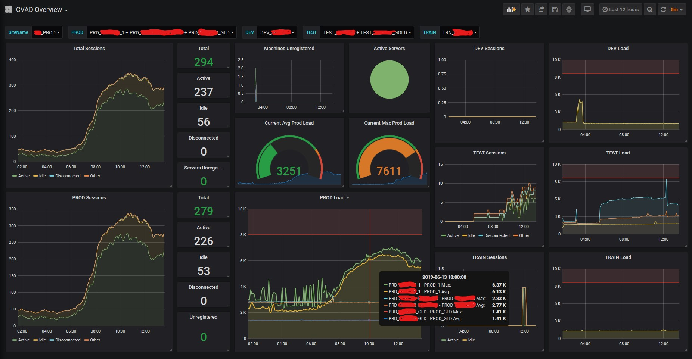

# EUCMonitoringRedux

Citrix Virtual Apps and Desktops Overview Dashboard

Citrix ADC Overview Dashboard

## Project Description

This is a continuation of the [EUCMonitoring Platform](http://bretty.me.uk/free-citrix-xendesktop-7-monitoring-platform/) that is based on Powershell and FREE! It will check all the key components of your End User Computer estate and give you a visual dashboard as to its current health. It is currently focused on Citrix but will eventually be branched out to cover VMware and Microsoft Technologies.

This continuation is organized in such a way that you could take advantage of the [Telegraf](https://www.influxdata.com/time-series-platform/telegraf/) agent for collecting and reporting metrics. In its simplest form, the telegraf agent works like a scheduled task running every 5 minutes, invoking a powershell script that outputs to [Influx Line Protocol](https://docs.influxdata.com/influxdb/v1.7/write_protocols/line_protocol_tutorial/). Telegraf takes that output and redirects it to any of its supported time series databases. I like [InfluxDB (v1)](https://www.influxdata.com/products/influxdb-overview/). We then configure Grafana to point to InfluxDB and visualize the results. It will create a local log file of any errors it finds, and will eventually make the static HTML file as well.

## Motivation

[Dave Bretty](https://bretty.me.uk) initially created this in order to provide a birds eye view of what's happening in the environment. Along with others in the community, I wanted to extend the functionality he initially created, especially in a more dynamic dashboard. I also want to be able to use building a monitoring platform as a way of teaching new users about various EUC platforms, by way of knowing what to look for. This also allows me a way to provide a read-only view into my environment to various individuals, create a web interface that can be used to drive office kiosk dashboards, and create custom dashboards for different groups.

This project is geared towards taking some useful scripts and visualizing their output.

## Installation

To install suggestions, check out [Installation.md](https://github.com/littletoyrobots/EUCMonitoringRedux/blob/master/Installation.md).

## Share

Have a great script or dashboard suggestion you'd like to see implemented? Check out [Contributing](https://github.com/littletoyrobots/EUCMonitoringRedux/blob/master/.github/CONTRIBUTING.md) or stop by the #-eucmonitoring channel on [World of EUC on Slack](https://communityinviter.com/apps/worldofeuc/world-of-euc-project) and share it with us!

## Contributors

Dave Brett [@dbretty](https://twitter.com/dbretty) | James Kindon [@james_kindon](https://twitter.com/james_kindon) | Ryan Butler [@ryan_c_butler](https://twitter.com/Ryan_C_Butler) | David Wilkinson [@WilkyIT](https://twitter.com/WilkyIT) | Adam Yarborough [@littletoyrobots](https://twitter.com/littletoyrobots) | Hal Lange [@hal_lange](https://twitter.com/hal_lange) | Ryan Revord [@rsrevord](https://twitter.com/rsrevord) | Alex Spicola [@alexspicola](https://twitter.com/AlexSpicola)
